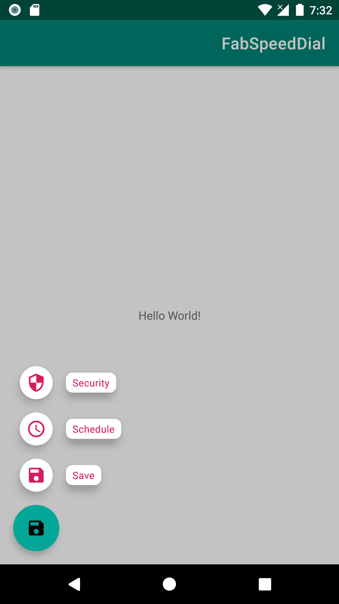

[](https://jitpack.io/#javaherisaber/FabSpeedDial)
# FabSpeedDial

Add Speed dial options on top of FloatingActionButton and ExtendedFloatingActionButton



## Dependency
Top level build.gradle
```groovy
allprojects {
   repositories {
    ...
    maven { url 'https://jitpack.io' }
  }
}
```

Module level build.gradle
```groovy
dependencies {
  implementation "com.github.javaherisaber:FabSpeedDial:$versions.fabSpeedDial"
}
```

## How to use
```kotlin
override fun onCreate(savedInstanceState: Bundle?) {
    findViewById<FloatingActionButton>(R.id.fab).setOnSpeedDialClickListener(
        items = speedDialItems(),
        onOptionClickListener = { _, index ->
            Toast.makeText(this, "You clicked at $index", Toast.LENGTH_SHORT).show()
        },
        textAppearance = R.style.App_TextAppearance_Caption,
        runGuard = ::shouldGuardOnDisplayOptions // false if you want speed dial to be displayed
    )
}

private fun shouldGuardOnDisplayOptions() = false

private fun speedDialItems(): List<Pair<CharSequence?, Drawable>> {
    val tint = colorAt(R.color.colorAccent)
    return listOf(
        "Save".color(tint) to drawableAt(R.drawable.ic_save_black_24dp).withTint(tint),
        "Schedule".color(tint) to drawableAt(R.drawable.ic_schedule_black_24dp).withTint(tint),
        "Security".color(tint) to drawableAt(R.drawable.ic_security_black_24dp).withTint(tint)
    )
}
```
